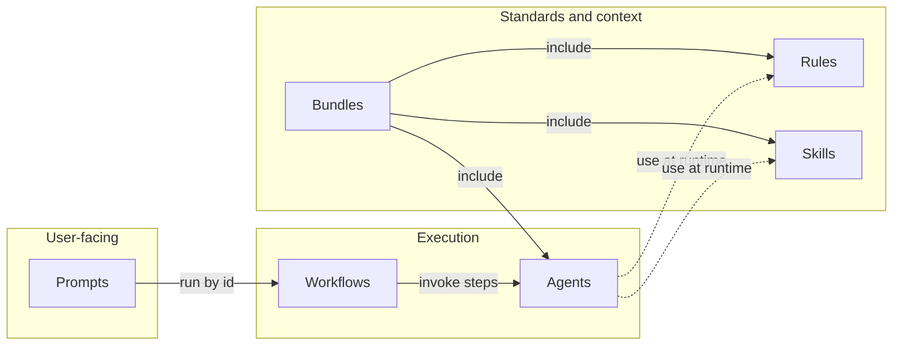
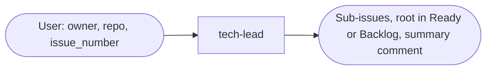
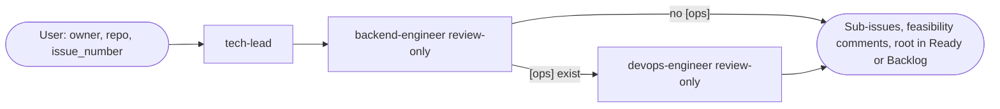
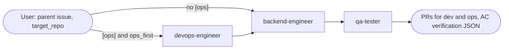
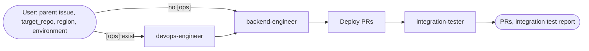
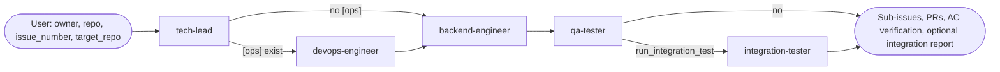
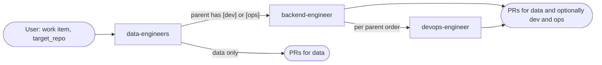
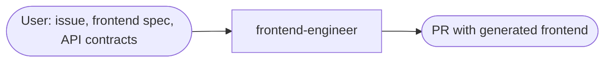

# Forge Registry

A Cursor/Forge asset registry containing **agents**, **bundles**, **prompts**, **rules**, and **workflows**. Use it to install or copy assets into consuming projects for standardized roles, standards, and multi-step processes.

## Asset overview

How the five asset types relate:

- **Prompts** trigger a workflow by id (plan mode + required inputs).
- **Workflows** define multi-step sequences and invoke **agents** in order.
- **Bundles** group agents, rules, and skills by project type; installing a bundle gives a project the right context for that type.
- **Rules** and **skills** are applied when an agent runs (from an installed bundle or from `.cursor/rules` / `.cursor/skills`).

---

## Asset types

### Agents ([agents/](agents/))

Single-role definitions: tech-lead, backend-engineer, devops-engineer, qa-tester, frontend-engineer, data-engineers, integration-tester. Each agent has `agent.md` (instructions and steps) and `manifest.yaml` (version, project types, description).

- **Invoked by workflows** in sequence (see [workflows/README.md](workflows/README.md)).
- **Grouped by bundles** by project type (backend, frontend, data-engineering, devops).

### Bundles ([bundles/](bundles/))

Project-type presets: **backend**, **frontend**, **data-engineering**, **devops**. Each bundle’s `manifest.yaml` lists agents, rules, skills, workflows, and prompts by id. Installing a bundle gives a project the right agents, rules, and skills for that type; workflows then use those agents when run in that project.

### Prompts ([prompts/](prompts/))

Reusable prompts to run a workflow: a generic template ([run-workflow.md](prompts/run-workflow.md), substitute `WORKFLOW_ID`) and one prompt per workflow under [prompts/workflows/](prompts/workflows/). Each prompt instructs the runner to run the workflow with **plan mode first** and **required inputs before run**. See [prompts/README.md](prompts/README.md).

### Rules ([rules/](rules/))

Coding and infrastructure standards (FastAPI, Terraform, AWS services, auth, Python quality, CI/CD, etc.). Each rule has `RULE.md` and a `manifest.yaml`. Rules are referenced by **bundles** (as `kind: rule`); when an agent runs, it follows the rules active in the project (e.g. from an installed bundle or `.cursor/rules/`).

### Workflows ([workflows/](workflows/))

Multi-step definitions: each workflow has a `manifest.yaml` (inputs, outputs, plan mode) and `WORKFLOW.md` (steps, conditionals, how to run). Workflows list **which agents to run in order**; they do not reference bundles. All workflows use **plan mode first** and **required inputs before run**. See [workflows/README.md](workflows/README.md).

---

## How each path works

### Path 1 – Prompt → Workflow → Agents

1. User runs a prompt (e.g. copy-paste from `prompts/workflows/backend-full-cycle.md` or use an installed prompt).
2. The prompt says: run workflow **backend-full-cycle** with plan mode and required inputs.
3. The runner reads `.cursor/workflows/backend-full-cycle/WORKFLOW.md`, presents the plan (steps + inputs), and collects required inputs.
4. After the user confirms and inputs are provided, the runner executes the steps in order (e.g. devops-engineer if [ops] exist, then backend-engineer, then qa-tester).
5. Each step invokes one agent. Rules and skills come from the project (e.g. from an installed bundle or `.cursor/rules` / `.cursor/skills`).

### Path 2 – Bundle (project type)

1. User or tooling installs a bundle (e.g. **backend**) into the project.
2. The project gets that bundle’s agents, rules, and skills (e.g. backend-engineer, devops-engineer, qa-tester plus FastAPI, AWS, Terraform rules, and skills like backend-task-breakdown).
3. User can run those agents manually or via workflows. When an agent runs, it uses the rules and skills from the bundle (or from the project’s `.cursor/rules` and `.cursor/skills`).
4. Workflows do not install bundles; they assume the right context is already present.

### Path 3 – Workflow without prompt

1. User or an orchestrator reads a workflow from `.cursor/workflows/<id>/WORKFLOW.md` (after the workflow is installed).
2. Same execution policy: **plan mode first**, collect **required inputs**, then run the workflow steps in order, invoking each agent with the documented inputs and passing outputs as context to the next step.

---

## Workflow diagrams

For each workflow in [workflows/](workflows/), the diagram below shows the steps, agents, and conditionals. All workflows use **plan mode first** and **required inputs before run**.

### 1. `issue-refinement`

Turn a parent GitHub issue in **Todo** into [dev]/[ops]/[qa] sub-issues and move the root to **Ready** (or Backlog if blocked).

**Assets:** tech-lead.

**Inputs:** owner, repo, issue_number; optional: target_repo.

---

### 2. `issue-refinement-with-feasibility`

Refine the parent issue, then backend-engineer and devops-engineer validate [dev] and [ops] sub-issues for feasibility (review-only; no code or infra changes).

**Assets:** tech-lead, backend-engineer (review-only), devops-engineer (review-only).

**Inputs:** owner, repo, issue_number; optional: target_repo.

**Conditional:** Skip devops-engineer if no [ops] sub-issues exist.

---

### 3. `backend-full-cycle`

Implement all [dev] (and [ops] if any) work for an already-refined parent issue and run QA verification.

**Assets:** devops-engineer, backend-engineer, qa-tester.

**Inputs:** owner, repo, parent_issue_number, target_repo; optional: ops_first.

**Conditionals:** Run devops-engineer first only when [ops] sub-issues exist and ops_first is true; otherwise start with backend-engineer.

---

### 4. `backend-implement-and-integration-test`

Implement backend (and infra if [ops]), then after deploy run integration-tester against deployed AWS services (Cognito, API Gateway, Lambda).

**Assets:** devops-engineer, backend-engineer, integration-tester (skills: aws-cognito-integration-check, aws-api-gateway-integration-check, aws-lambda-integration-check).

**Inputs:** owner, repo, parent_issue_number, target_repo, region, environment; optional: ops_first, base_url.

**Conditional:** Run devops-engineer before backend-engineer when [ops] sub-issues exist.

---

### 5. `full-story-delivery`

End-to-end: parent issue in Todo → refine → implement [ops] then [dev] → QA → optional post-deploy integration test.

**Assets:** tech-lead, devops-engineer, backend-engineer, qa-tester, integration-tester.

**Inputs:** owner, repo, issue_number, target_repo; optional: run_integration_test.

**Conditionals:** Skip devops-engineer if no [ops] sub-issues; skip integration-tester if run_integration_test is false.

---

### 6. `data-engineering-delivery`

Implement data work (pipelines, models, Delta Lake in S3); if the same parent has [dev] or [ops] sub-issues, coordinate with backend-engineer and/or devops-engineer per parent order.

**Assets:** data-engineers; optionally backend-engineer, devops-engineer (documented coordination, not auto-invoked).

**Inputs:** work_item_or_parent_issue, target_repo.

**Conditionals:** Data-only: data-engineers only. Data + [dev]/[ops]: run data-engineers, then backend and/or devops in the order specified by the parent or team.

---

### 7. `frontend-delivery`

Single step: run frontend-engineer with an approved issue and frontend spec to generate frontend via Lovable MCP and open a PR.

**Assets:** frontend-engineer (uses Lovable MCP; skill: lovable-prompts from frontend bundle).

**Inputs:** issue_reference, frontend_specification, api_contracts; optional: target_repo.

---

## Quick reference – workflows

| Id | Description |
|----|-------------|
| `issue-refinement` | Turn a parent GitHub issue in Todo into [dev]/[ops]/[qa] sub-issues and move root to Ready. |
| `issue-refinement-with-feasibility` | Refine an issue, then backend and devops validate [dev]/[ops] sub-issues for feasibility before implementation. |
| `backend-full-cycle` | Implement [dev] (and [ops] if any) work and run QA verification. |
| `backend-implement-and-integration-test` | Implement backend/infra, then run integration-tester on deployed AWS services. |
| `full-story-delivery` | End-to-end: refine → implement [ops] then [dev] → QA → optional integration test. |
| `data-engineering-delivery` | Implement data work; coordinate with backend/devops when same parent has [dev]/[ops]. |
| `frontend-delivery` | Single-step: run frontend-engineer with issue and frontend spec to produce a PR via Lovable. |

For full workflow list, execution policy, and how to reference workflows in Cursor, see [workflows/README.md](workflows/README.md). For prompts that run each workflow, see [prompts/README.md](prompts/README.md).
