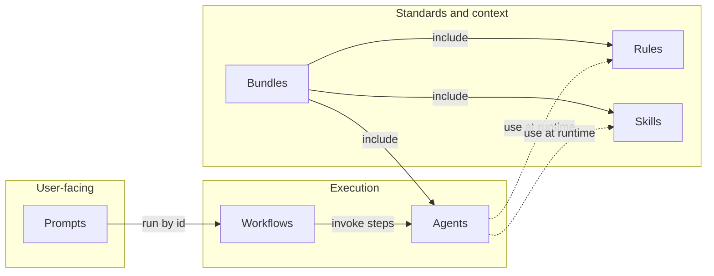

# Forge Registry

A Cursor/Forge asset registry containing **agents**, **bundles**, **prompts**, **rules**, and **workflows**. Use it to install or copy assets into consuming projects for standardized roles, standards, and multi-step processes.

## Asset overview

How the five asset types relate:

```mermaid
flowchart LR
  subgraph userFacing [User-facing]
    Prompts
  end
  subgraph execution [Execution]
    Workflows
    Agents
  end
  subgraph standards [Standards and context]
    Bundles
    Rules
    Skills
  end
  Prompts -->|"run by id"| Workflows
  Workflows -->|"invoke steps"| Agents
  Bundles -->|"include"| Agents
  Bundles -->|"include"| Rules
  Bundles -->|"include"| Skills
  Agents -.->|"use at runtime"| Rules
  Agents -.->|"use at runtime"| Skills
```

- **Prompts** trigger a workflow by id (plan mode + required inputs).
- **Workflows** define multi-step sequences and invoke **agents** in order.
- **Bundles** group agents, rules, and skills by project type; installing a bundle gives a project the right context for that type.
- **Agents** are role-only: they define responsibility and **equip skills by context**; they do not reference specific tools or MCPs directly. All GitHub, Confluence, and AWS interactions (issues, PRs, project board, discovery) are performed **via skills**, not in agent logic.
- **Rules** and **skills** are applied when an agent runs (from an installed bundle or from `.cursor/rules` / `.cursor/skills`). Agents refer to skills by id and use a "Skills to equip by context" section for guidance; the runner or environment provides the actual capabilities. See [docs/skill-conventions.md](docs/skill-conventions.md) for interaction vs domain skills and when to use.

---

## Asset types

### Agents ([agents/](agents/))

Single-role definitions: tech-lead, backend-engineer, devops-engineer, qa-tester, product-owner, frontend-engineer, data-engineer, requirements-refiner, channel-specialist-google-ads, and monitoring. Each agent has `agent.md` (instructions, steps, and **Skills to equip by context**) and `manifest.yaml` (version, project types, description).

**Consolidated canonical roles:** QA and product responsibilities are consolidated into two role-only agents powered by skills:
- **qa-tester** – Single QA role with three modes: AC validation (qa-validation), integration validation (aws-cli), and discovery-assisted (aws-resource-discovery). Use qa-tester for all Phase 4 verification and post-deploy integration checks.
- **product-owner** – Single product role with three modes: problem shaping (problem-shaping), spec writing / Phase 1 (spec-writing), and feasibility assessment (feasibility-assessment). Use product-owner for Phase 1 discovery, idea shaping, and feasibility assessment.

- **Role-only, no hardcoded tools:** Agents never reference MCP or tool names directly. All issue/PR/board/Confluence/AWS operations are done via **skills** (e.g. github-issue-operations, github-pr-operations, confluence-fetch, aws-resource-discovery).
- **Invoked by workflows** in sequence (see [workflows/README.md](workflows/README.md)).
- **Grouped by bundles** by project type (backend, frontend, data, infra, product). Bundles include the interaction and domain skills agents need.

### Bundles ([bundles/](bundles/))

Project-type presets: **backend**, **frontend**, **data-engineering**, **devops**, **product**, **project-team**. Each bundle’s `manifest.yaml` lists agents, rules, skills, workflows, and prompts by id. Installing a bundle gives a project the right agents, rules, and skills for that type; workflows then use those agents when run in that project. The **product** bundle is the single entry point for product-type projects: generate docs, refine issues, craft issues, and improve raw ideas (product-owner, requirements-refiner, qa-tester, tech-lead, channel-specialist-google-ads, and supporting skills/workflows). The **project-team** bundle provides product-owner, requirements-refiner, channel-specialist-google-ads, qa-tester, and the idea-to-backlog workflow.

### Prompts ([prompts/](prompts/))

Reusable prompts to run a workflow: a generic template ([run-workflow.md](prompts/run-workflow.md), substitute `WORKFLOW_ID`) and one prompt per workflow under [prompts/workflows/](prompts/workflows/). Each prompt instructs the runner to run the workflow with **plan mode first** and **required inputs before run**. See [prompts/README.md](prompts/README.md).

### Rules ([rules/](rules/))

Coding and infrastructure standards (FastAPI, Terraform, AWS services, auth, Python quality, CI/CD, etc.). Each rule has `RULE.md` and a `manifest.yaml`. Rules are referenced by **bundles** (as `kind: rule`); when an agent runs, it follows the rules active in the project (e.g. from an installed bundle or `.cursor/rules/`).

Key spec-driven rules:

- **`foundation-global-principles`** – Always-on global engineering principles (simplicity, clarity, explicitness).
- **`spec-driven-gap-handling`** – Gap-handling protocol and human checkpoints for Phases 1–5: never silently patch gaps; route spec gaps to Phase 1 and task gaps to Phase 2; enforce human sign-off in Phase 4 and human hotfix/new-feature decision in Phase 5.

### Workflows ([workflows/](workflows/))

Multi-step definitions: each workflow has a `manifest.yaml` (inputs, outputs, plan mode) and `WORKFLOW.md` (steps, conditionals, how to run). Workflows list **which agents to run in order**; they do not reference bundles. All workflows use **plan mode first** and **required inputs before run**. The **canonical spec-driven lifecycle** is one workflow per phase plus a full-cycle: `discovery` (Phase 1), `planning` (Phase 2), `implementation` (Phase 3), `testing-validation` (Phase 4), `feedback-monitoring` (Phase 5), and `full-cycle` (1→5). See [workflows/README.md](workflows/README.md) and [REFACTORING.md](REFACTORING.md).

---

## How each path works

### Path 1 – Prompt → Workflow → Agents

1. User runs a prompt (e.g. copy-paste from `prompts/workflows/full-cycle.md` or use an installed prompt).
2. The prompt says: run workflow **full-cycle** with plan mode and required inputs.
3. The runner reads `.cursor/workflows/full-cycle/WORKFLOW.md`, presents the plan (steps + inputs), and collects required inputs.
4. After the user confirms and inputs are provided, the runner executes the steps in order (e.g. devops-engineer if [ops] exist, then backend-engineer, then qa-tester).
5. Each step invokes one agent. Rules and skills come from the project (e.g. from an installed bundle or `.cursor/rules` / `.cursor/skills`).

### Path 2 – Bundle (project type)

1. User or tooling installs a bundle (e.g. **backend**) into the project.
2. The project gets that bundle’s agents, rules, and skills (e.g. backend-engineer, devops-engineer, qa-tester plus FastAPI, AWS, Terraform rules, and skills like backend-task-breakdown).
3. User can run those agents manually or via workflows. When an agent runs, it uses the rules and skills from the bundle (or from the project’s `.cursor/rules` and `.cursor/skills`).
4. Workflows do not install bundles; they assume the right context is already present.

### Path 3 – Workflow without prompt

1. User or an orchestrator reads a workflow from `.cursor/workflows/<id>/WORKFLOW.md` (after the workflow is installed).
2. Same execution policy: **plan mode first**, collect **required inputs**, then run the workflow steps in order, invoking each agent with the documented inputs and passing outputs as context to the next step.

---

## Workflow diagrams

For each canonical workflow in [workflows/](workflows/), the diagrams below show the **agents**, **skills**, and **rules** involved. All of these workflows:

- **Use plan mode first** and **require inputs before run**.
- **Follow `spec-driven-gap-handling`** for gap routing and human checkpoints.
- Are governed by **`foundation-global-principles`** plus any project-specific rules from installed bundles.

### 1. `discovery` (Phase 1)

Turn a raw idea into a spec.

- **Agents:** `product-owner` (spec-writing mode)
- **Key skills:** `spec-writing` (+ `confluence-fetch` optional)
- **Key rules:** `foundation-global-principles`, `spec-driven-gap-handling`

```mermaid
flowchart LR
  Start([User: raw_idea + optional context])
  PO[product-owner<br/>(spec-writing)]
  Spec[Spec file<br/>(requirements + AC + success metrics)]

  Start --> PO --> Spec
```

---

### 2. `planning` (Phase 2)

Turn a spec into GitHub issues with subtasks mapped to acceptance criteria.

- **Agents:** Planning agent (e.g. `product-owner` or `requirements-refiner`)
- **Key skills:** `github-issue`, `github-issue-operations`, `github-issue-creation-standards`, `github-sub-issue-linking`, `github-project-board`; `aws-context`, `aws-resource-discovery` (when infra is involved)
- **Key rules:** `foundation-global-principles`, `spec-driven-gap-handling`

```mermaid
flowchart LR
  Start([User: spec + owner/repo + optional project])
  Infra{Spec involves infra/AWS?}
  AWS[aws-context<br/>(aws-context + aws-resource-discovery)]
  Planner[Planning agent<br/>(github-issue* skills)]
  Issues[GitHub issues<br/>+ subtasks per AC]

  Start --> Infra
  Infra -- "yes" --> AWS --> Planner
  Infra -- "no" --> Planner
  Planner --> Issues
```

---

### 3. `implementation` (Phase 3)

Implement one or more issues as code and infrastructure changes.

- **Agents:** Implementation agents (`backend-engineer`, `frontend-engineer`, `devops-engineer`)
- **Key skills:** `api-implementation`, `ui-implementation`, `terraform`; `backend-task-breakdown`, `lovable-prompts`, `terraform-github-actions`; `github-issue-operations`, `github-pr-operations`
- **Key rules:** `foundation-global-principles`, `spec-driven-gap-handling`

```mermaid
flowchart LR
  Start([User: issue_ids + owner/repo + target_repo])
  Scope[Fetch issues<br/>+ determine scope]
  Impl[Implementation agents<br/>(backend/front/devops)]
  Gap{Gap not covered<br/>by subtasks/spec?}
  GapReport[[Gap report<br/>route back to Phase 1/2]]
  PRs([PRs + infra changes<br/>linked to issues])

  Start --> Scope --> Impl --> Gap
  Gap -- "yes" --> GapReport
  Gap -- "no" --> PRs
```

---

### 4. `testing-validation` (Phase 4)

Validate implementation against the spec and produce a QA report.

- **Agents:** `qa-tester`
- **Key skills:** `qa-validation`; `aws-cli`, `aws-cognito-integration-check`, `aws-api-gateway-integration-check`, `aws-lambda-integration-check`; `github-issue-operations`, `github-pr-operations`
- **Key rules:** `foundation-global-principles`, `spec-driven-gap-handling` (including human sign-off before deployment)

```mermaid
flowchart LR
  Start([User: issue_ids + spec + implementation refs])
  QASpec[qa-tester<br/>(qa-validation)]
  QAInt[qa-tester<br/>(aws-cli integration checks)]
  Report[QA report<br/>+ Approve / Fix / Escalate]
  Human[Human sign-off<br/>before deployment]

  Start --> QASpec --> QAInt --> Report --> Human
```

---

### 5. `feedback-monitoring` (Phase 5)

Produce a feedback report from a deployed feature.

- **Agents:** `monitoring`
- **Key skills:** `monitoring`
- **Key rules:** `foundation-global-principles`, `spec-driven-gap-handling` (human decides hotfix vs new feature)

```mermaid
flowchart LR
  Start([User: deployed_feature_ref<br/>+ acceptance_criteria + logs/metrics])
  Monitor[monitoring agent<br/>(monitoring)]
  Feedback[Feedback report<br/>metrics vs criteria + ideas]
  Human[Human decides<br/>hotfix or new feature]

  Start --> Monitor --> Feedback --> Human
```

---

### 6. `full-cycle` (Phases 1→5)

Run the complete lifecycle from raw idea through deployment and feedback.

- **Agents:** `product-owner`, planning agent, implementation agents (`backend-engineer`, `frontend-engineer`, `devops-engineer`), `qa-tester`, `monitoring`
- **Key skills:** All skills used in Phases 1–5 (`spec-writing`, `github-issue`, `aws-context`, `api-implementation`, `ui-implementation`, `terraform`, `qa-validation`, `aws-cli`, `monitoring`, plus delegated skills from their groups)
- **Key rules:** `foundation-global-principles`, `spec-driven-gap-handling`

```mermaid
flowchart LR
  Idea([Raw idea])
  Disc[discovery<br/>(Phase 1)]
  Plan[planning<br/>(Phase 2)]
  Impl[implementation<br/>(Phase 3)]
  Test[testing-validation<br/>(Phase 4)]
  Deploy[Deployment<br/>(team-specific)]
  Feed[feedback-monitoring<br/>(Phase 5)]
  Output([Feedback report<br/>+ next ideas])

  Idea --> Disc --> Plan --> Impl --> Test --> Deploy --> Feed --> Output

  Gap[[Spec/task gap?<br/>route back via spec-driven-gap-handling]]
  Impl -. discovers gap .-> Gap
  Plan -. discovers gap .-> Gap
  Feed -. improvements .-> Disc
```

---

## Quick reference – canonical workflows

| Id | Phases | Description |
|----|--------|-------------|
| `discovery` | 1 | Raw idea → spec with acceptance criteria and success metrics. |
| `planning` | 2 | Spec → GitHub issues with subtasks mapped to acceptance criteria. |
| `implementation` | 3 | Issues → code/infra changes (PRs), with gap handling. |
| `testing-validation` | 4 | Implementation + spec → QA report and human sign-off. |
| `feedback-monitoring` | 5 | Deployed feature → feedback report and routing (hotfix vs new feature). |
| `full-cycle` | 1→5 | Raw idea → Discovery → Planning → Implementation → Testing → deployment → Feedback & Monitoring. |

For the full workflow list (including legacy and domain-specific workflows), execution policy, and how to reference workflows in Cursor, see [workflows/README.md](workflows/README.md). For prompts that run each workflow, see [prompts/README.md](prompts/README.md).

