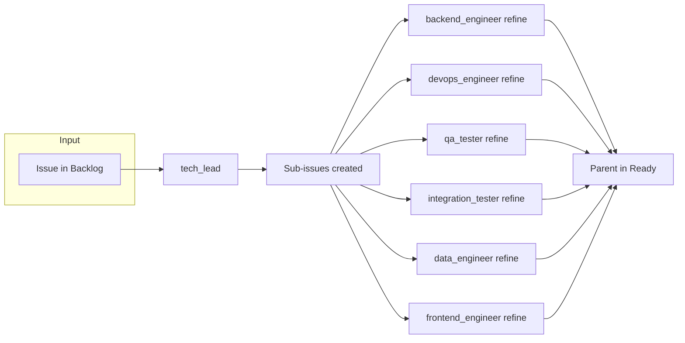

# Workflow: Backlog to Ready (Linear)

Flow from a parent Linear issue in **Backlog** through tech-lead refinement, technical feasibility, creation of applicable sub-issues (with **Agents labels**), specialist refinement of each sub-issue (description only), and finally moving the parent to **Ready**.

## Before you run

- **Plan mode:** Start in plan mode. Present the plan (this workflow's steps and the inputs below). Do not execute any step until the user confirms the plan.
- **Required inputs:** Before running, prompt the user for every **required** input listed in the Inputs table. Do not execute until all required inputs are provided. Optional inputs (marked "User (optional)" in the table) may use defaults or be prompted as needed.

## Work tracking

- **Tracker:** Linear. All issues and sub-issues are created/updated in **project Adlyze** and **milestone MVP** (as defined by the Linear skills). Team is supplied as input (e.g. Drivven).
- **Source status:** Backlog
- **Target status:** Ready (after refinement completes)

Use **linear-issue-operations**, **linear-sub-issue-linking**, and **linear-issue-status** for all work-item operations; those skills use **project Adlyze** and **milestone MVP**. Use the exact status name **Ready** (not Todo) when moving the parent after refinement.

## Inputs

| Name             | Source          | Description                                                    |
| ---------------- | --------------- | -------------------------------------------------------------- |
| team             | User            | Linear team (e.g. Drivven).                                    |
| project          | User            | Linear project; use **Adlyze** (skills use Adlyze + MVP).      |
| issue_identifier | User            | Parent issue in Backlog (e.g. LIN-123 or Linear issue ID).     |
| target_repo      | User (optional) | Target repository for implementation; for context if needed.  |

## Outputs

- **Refined parent issue** – Description updated by tech-lead with technical feasibility notes if needed.
- **Sub-issues created and linked** – With **Agents labels** (Backend Engineer, DevOps Engineer, Quality Assurance, Data Engineer, Frontend Engineer, Tech Lead) only where applicable.
- **Refinement comments** – Each created sub-issue has its description improved by the corresponding specialist agent and a comment "This issue was refined by [agent name]."
- **Parent in Ready** – Parent issue state set to **Ready** (or comment added asking to move if the integration cannot update the state).

## Pipeline overview

In practice: tech-lead runs once (refine + create sub-issues with Agents labels). Then **for each** created sub-issue, the orchestrator invokes the matching specialist agent in refinement-only mode. Only the agents for which at least one sub-issue was created (by label) are invoked. Finally, the parent issue is moved to **Ready**.

## Steps

1. **Validate input and ensure issue is in Backlog**
   Orchestrator: Confirm the issue (team, project, issue_identifier) exists in Linear and is in **Backlog** state. Collect target_repo if needed for context. If the issue is not in Backlog, stop and ask the user to move it or provide an issue that is.

2. **Run tech-lead (refine + feasibility + create sub-issues)**
   Invoke **tech-lead** with team, project, issue_identifier, and optional target_repo. Tech-lead will:
   - Analyze the parent issue and check technical feasibility (AWS resources, related repos).
   - Refine the parent issue description if needed (e.g. add technical feasibility section) via **linear-issue-operations**.
   - Create and link sub-issues with **Agents labels** (Backend Engineer, DevOps Engineer, Quality Assurance, Data Engineer, Frontend Engineer, Tech Lead) only where applicable, using **linear-sub-issue-linking**.
   - **If tech-lead leaves the issue in Backlog due to blockers:** Stop the workflow. Do not run step 3 or 4. Document blockers on the issue via **linear-issue-operations**; user must resolve before re-running.
   - **If refinement complete:** Tech-lead may move the parent to **Ready** at the end of its run via **linear-issue-status**, or the orchestrator will do it in step 4. Do not run step 4 if tech-lead already moved it.

3. **Refine each sub-issue with the corresponding specialist (refinement-only)**
   For each **Agents label** for which tech-lead created at least one sub-issue, invoke the **corresponding specialist agent** once per sub-issue with the **refinement-only instruction** below. The agent must **not** implement or open a PR; it only improves the sub-issue description and adds a comment.
   **Refinement-only instruction** (pass this to each specialist):
   *"Do not implement or open a PR. Your only task is to read this sub-issue, improve its description with implementation details relevant to your domain (scope, technical approach, acceptance criteria), use the linear-issue-operations skill to update the issue description and add a comment on the sub-issue: 'This issue was refined by [agent name].'"*
   **Agent → Agents label mapping:**

   | Agents label      | Agent (id)         |
   | ----------------- | ------------------ |
   | Backend Engineer  | backend-engineer   |
   | DevOps Engineer  | devops-engineer    |
   | Quality Assurance| qa-tester          |
   | Quality Assurance| integration-tester (when integration-specific) |
   | Data Engineer    | data-engineers     |
   | Frontend Engineer| frontend-engineer  |

   Invoke only agents for which at least one sub-issue exists. For multiple sub-issues with the same label (e.g. two Backend Engineer issues), invoke the specialist once per sub-issue, passing the specific sub-issue identifier.

4. **Move parent issue to Ready**
   Orchestrator or tech-lead: Use **linear-issue-status** to set the **parent issue** state to **Ready**. If the integration does not support updating the state, add a prominent comment on the parent via **linear-issue-operations**: "Refinement complete – **move this issue to Ready**" and note in the workflow summary that the issue must be moved manually.

## Conditionals

- **Tech-lead leaves issue in Backlog (blockers):** Do not run specialist refinement (step 3); do not move to Ready (step 4). Workflow stops; blockers are documented on the issue.
- **No sub-issues created:** If tech-lead creates zero sub-issues, skip step 3. Move parent to Ready in step 4 only if tech-lead indicated refinement complete.
- **Linear API cannot update state:** Add comment "Refinement complete – **move this issue to Ready**" on the parent so a human or parent agent can move the issue.

## How to reference in Cursor

- Install to `.cursor/workflows/backlog-to-ready-linear/`.
- Run steps 1 through 4 in order. Step 3 runs only for each Agents label that has at least one created sub-issue.
- An orchestrator agent can read this file and invoke tech-lead, then each specialist (backend-engineer, devops-engineer, qa-tester, integration-tester, data-engineers, frontend-engineer) in refinement-only mode for the relevant sub-issues, then move the parent to **Ready**.
