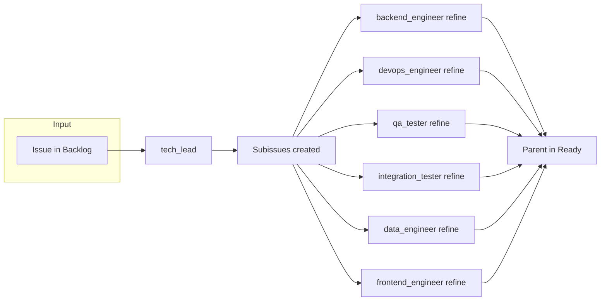

# Workflow: Backlog to Ready

Flow from a parent GitHub issue in **Backlog** ([https://github.com/orgs/DrivvenConsulting/projects/6](https://github.com/orgs/DrivvenConsulting/projects/6)) through tech-lead refinement, technical feasibility, creation of applicable subissues ([dev], [ops], [qa], [int], [data], [front]), specialist refinement of each subissue (description only), and finally moving the parent to **Ready**.

## Before you run

- **Plan mode:** Start in plan mode. Present the plan (this workflow's steps and the inputs below). Do not execute any step until the user confirms the plan.
- **Required inputs:** Before running, prompt the user for every **required** input listed in the Inputs table. Do not execute until all required inputs are provided. Optional inputs (marked "User (optional)" in the table) may use defaults or be prompted as needed.

## Work tracking

- **Project:** [DrivvenConsulting/projects/6](https://github.com/orgs/DrivvenConsulting/projects/6)
- **Repo for work items:** [DrivvenConsulting/adlyze](https://github.com/DrivvenConsulting/adlyze) (or the repo where the issue lives). All issues and subissues are created/updated in this project.
- **Source column:** Backlog
- **Target column:** Ready (after refinement completes)

## Inputs

| Name         | Source          | Description                                                             |
| ------------ | --------------- | ----------------------------------------------------------------------- |
| owner        | User            | GitHub org or owner (e.g. DrivvenConsulting).                           |
| repo         | User            | Repository name (e.g. adlyze).                                          |
| issue_number | User            | Parent issue number in Backlog.                                         |
| target_repo  | User (optional) | Target repository for implementation; defaults to repo if not provided. |

## Outputs

- **Refined parent issue** – Body updated by tech-lead with technical feasibility notes if needed.
- **Subissues created and linked** – Prefixed [dev], [ops], [qa], [int], [data], [front] only where applicable.
- **Refinement comments** – Each created subissue has its description improved by the corresponding specialist agent and a comment "This issue was refined by [agent name]."
- **Parent in Ready** – Parent issue moved to Ready column (or comment added asking to move if MCP cannot update board).

## Pipeline overview

In practice: tech-lead runs once (refine + create subissues). Then **for each** created subissue, the orchestrator invokes the matching specialist agent in refinement-only mode. Only the agents for which at least one subissue was created are invoked. Finally, the parent issue is moved to Ready.

## Steps

1. **Validate input and ensure issue is in Backlog**
  Orchestrator: Confirm the issue (owner, repo, issue_number) exists and is in the **Backlog** column of project 6. Collect target_repo if not provided (default to repo). If the issue is not in Backlog, stop and ask the user to move it or provide an issue that is.
2. **Run tech-lead (refine + feasibility + create subissues)**
  Invoke **tech-lead** with owner, repo, issue_number, and optional target_repo. Tech-lead will:
  - Analyze the parent issue and check technical feasibility (AWS resources, related repos).
  - Refine the parent issue body if needed (e.g. add technical feasibility section).
  - Create and link subissues with prefixes **[dev], [ops], [qa], [int], [data], [front]** only where applicable.
  - **If tech-lead leaves the issue in Backlog due to blockers:** Stop the workflow. Do not run step 3 or 4. Document blockers on the issue; user must resolve before re-running.
  - **If refinement complete:** Tech-lead may move the parent to Ready at the end of its run, or the orchestrator will do it in step 5. Do not run step 5 if tech-lead already moved it.
3. **Refine each subissue with the corresponding specialist (refinement-only)**
  For each **prefix** for which tech-lead created at least one subissue, invoke the **corresponding specialist agent** once per subissue with the **refinement-only instruction** below. The agent must **not** implement or open a PR; it only improves the subissue description and adds a comment.
   **Refinement-only instruction** (pass this to each specialist):  
   *"Do not implement or open a PR. Your only task is to read this subissue, improve its description with implementation details relevant to your domain (scope, technical approach, acceptance criteria), update the issue body via GitHub MCP, and add a comment on the subissue: 'This issue was refined by [agent name].'"*
   **Agent → prefix mapping:**

  | Prefix  | Agent (id)         |
  | ------- | ------------------ |
  | [dev]   | backend-engineer   |
  | [ops]   | devops-engineer    |
  | [qa]    | qa-tester          |
  | [int]   | integration-tester |
  | [data]  | data-engineers     |
  | [front] | frontend-engineer  |

   Invoke only agents for which at least one subissue exists. For multiple subissues with the same prefix (e.g. two [dev] issues), invoke the specialist once per subissue, passing the specific subissue number.
4. **Move parent issue to Ready**
  Orchestrator or tech-lead: Move the **parent issue** to the **Ready** column on the project board. If the GitHub MCP does not support moving the issue, try use gh cli. If none works, add a prominent comment on the parent: "Refinement complete – **move this issue to Ready**" and note in the workflow summary that the issue must be moved manually.

## Conditionals

- **Tech-lead leaves issue in Backlog (blockers):** Do not run specialist refinement (step 3); do not move to Ready (step 4). Workflow stops; blockers are documented on the issue.
- **No subissues created:** If tech-lead creates zero subissues, skip step 3. Move parent to Ready in step 4 only if tech-lead indicated refinement complete.
- **Project board APIs unavailable:** Add comment "Refinement complete – **move this issue to Ready**" on the parent so a human or parent agent can move the card.

## How to reference in Cursor

- Install to `.cursor/workflows/backlog-to-ready/`.
- Run steps 1 through 4 in order. Step 3 runs only for each prefix that has at least one created subissue.
- An orchestrator agent can read this file and invoke tech-lead, then each specialist (backend-engineer, devops-engineer, qa-tester, integration-tester, data-engineers, frontend-engineer) in refinement-only mode for the relevant subissues, then move the parent to Ready.

