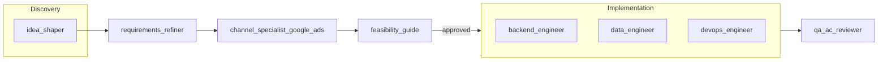

# Workflow: Feature definition to delivery

Pipeline from problem framing (idea_shaper) through requirements, channel validation, technical feasibility, implementation (backend_engineer / data_engineer / devops_engineer), and QA (qa_ac_reviewer). Work tracking via DrivvenConsulting/projects/6; artifacts under `artifacts/feature-definitions/<feature_name>/`.

## Before you run

- **Plan mode:** Start in plan mode. Present the plan (this workflow's stages and the inputs below). Do not execute any step until the user confirms the plan.
- **Required inputs:** Before running, prompt the user for every **required** input listed in the Inputs table. Do not execute until all required inputs are provided. Optional inputs may use defaults or be prompted as needed.

## Inputs

| Name | Source | Description |
|------|--------|-------------|
| feature_name | User | Snake_case slug for artifact paths (e.g. `google_sso`, `export_daily_reports`). |
| raw_idea | User (optional) | Raw feature idea or problem statement for idea_shaper; if omitted, start from requirements_refiner with a supplied problem statement. |
| owner | User (optional) | GitHub org or owner for project/repo. |
| repo | User (optional) | Repository name for work items and PRs. |
| target_repo | User (optional) | Target repository if different from issue repo. |

## Outputs

- **Artifacts** – JSON artifacts under `artifacts/feature-definitions/<feature_name>/` (feature-definition.json, github_issue.json, channel-feasibility.json, technical-feasibility.json, AC verification from qa_ac_reviewer).
- **Work item** – Created in DrivvenConsulting/projects/6; column moves Backlog → Ready → In Progress → In Review → Done.
- **PR(s)** – From backend_engineer, data_engineer, devops_engineer linked to the work item.

## Pipeline overview

## Work tracking

Work tracking uses the **centralized project** [DrivvenConsulting/projects/6](https://github.com/orgs/DrivvenConsulting/projects/6). Project columns:

| Column | When |
|--------|------|
| **Backlog** | After requirements_refiner (and channel_specialist when applicable); before feasibility approval. |
| **Ready** | After feasibility_guide approves. |
| **In Progress** | When backend_engineer / data_engineer / devops_engineer are working. |
| **In Review** | When qa_ac_reviewer runs or PR(s) are under review. |
| **Done** | Merged and accepted. |

If the MCP does not support project board APIs, agents document the intended column (e.g. in the work item body or in the artifact) so a human or parent agent can move the item.

## Artifact paths

All agents write artifacts under **`artifacts/feature-definitions/<feature_name>/`**. Canonical filenames:

| File | Producer |
|------|----------|
| `feature-definition.json` | idea_shaper |
| `github_issue.json` | requirements_refiner |
| `technical-feasibility.json` | feasibility_guide |
| `channel-feasibility.json` or `channel-feasibility-google-ads.json` | channel_specialist_google_ads |

The parent agent or inputs must supply `<feature_name>` so each agent can write to the correct folder.

## Stages

### 1. Problem framing (optional)

| Agent | When to use | Inputs | Output | Next step |
|-------|-------------|--------|--------|-----------|
| **idea_shaper** | Only a problem statement and context alignment are needed (quick validation, or before human-led discovery). | Raw idea; optional Confluence vision. | **JSON artifact** (problem_statement, context_alignment, assumptions). | Pass JSON to **requirements_refiner**. |

- Use **idea_shaper** for problem-only framing. If the user provides a problem statement directly, skip to stage 2 and pass it to requirements_refiner.

### 2. Requirements

| Agent | Inputs | Output | Next step |
|-------|--------|--------|-----------|
| **requirements_refiner** | Problem statement (from idea_shaper or user); target project DrivvenConsulting/projects/6; optional repo. | **JSON artifact** (issue definition). Writes to `artifacts/feature-definitions/<feature_name>/github_issue.json`. Creates work item in project and sets column to **Backlog**. | Run **channel_specialist_google_ads** (if feature touches an external channel), then **feasibility_guide**. |

### 3. Channel validation (if feature touches external channel)

| Agent | Inputs | Output | Next step |
|-------|--------|--------|-----------|
| **channel_specialist_google_ads** | Work item in **Backlog** (DrivvenConsulting/projects/6); work item URL/number. | **JSON artifact** (channel feasibility). Writes to `artifacts/feature-definitions/<feature_name>/channel-feasibility.json` (or `channel-feasibility-google-ads.json`). May append Channel Feasibility section to the work item. | Run **feasibility_guide**. |

- If the feature does not touch Google Ads (or other channels with a specialist), skip this stage but ensure feasibility_guide has enough context.

### 4. Technical feasibility

| Agent | Inputs | Output | Next step |
|-------|--------|--------|-----------|
| **feasibility_guide** | Work item in **Backlog** **with** Channel Feasibility section (if channel applies); architecture context. | **JSON artifact** (technical feasibility). Writes to `artifacts/feature-definitions/<feature_name>/technical-feasibility.json`. Adds Technical Feasibility section to work item; if approved moves to **Ready**, else stays **Backlog**. | If **Ready**: run **backend_engineer**, **data_engineer**, and/or **devops_engineer** as needed. If **Backlog**: address blockers before re-running feasibility. |

### 5. Implementation

| Agent | Inputs | Output | Next step |
|-------|--------|--------|-----------|
| **backend_engineer** | Work item in **Ready**; target repo; backend standards. Moves item to **In Progress** when starting. | PR linked to work item (APIs, services, tests). | Optional: **qa_ac_reviewer** after PR(s) exist. |
| **data_engineer** | Work item in **Ready**; target repo; data architecture context. Moves item to **In Progress** when starting. | PR linked to work item (ingestion, models, pipelines). | Optional: **qa_ac_reviewer** after PR(s) exist. |
| **devops_engineer** | Work item in **Ready**; target repo; infra/CI standards. Moves item to **In Progress** when starting. | PR linked to work item (Terraform, CI/CD, observability). | Optional: **qa_ac_reviewer** after PR(s) exist. |

- If a work item needs more than one of these agents, coordinate via the same project item; follow parent-specified order if given (e.g. data then backend then devops).

### 6. Verification (optional)

| Agent | Inputs | Output | Next step |
|-------|--------|--------|-----------|
| **qa_ac_reviewer** | Work item in **Ready** or **In Progress**; PR number(s) or branch(es) linked to the item. Moves item to **In Review** when running. | **JSON artifact** (AC verification: issue_number, pr_numbers, ac_verification, gaps, test_coverage_note). May also post a human-readable summary as a comment. | Human review / merge; then move item to **Done**. |

## Branching rules

1. **Channel Feasibility says "adjust requirements"**  
   Loop back to **requirements_refiner**: either update the existing work item (with a comment or body edit describing the adjustment) or create a follow-up item. Do not move to feasibility_guide until requirements are updated and channel specialist is re-run or explicitly skipped.

2. **Technical Feasibility is "blocked"**  
   Leave the work item in **Backlog**. Do not move to Ready. Document in the work item what is blocking and what would unblock. Optionally create a follow-up item for the blocker.

3. **Work item touches multiple channels**  
   Run each relevant channel specialist (e.g. channel_specialist_google_ads) and ensure all Channel Feasibility sections are on the work item before running feasibility_guide.

4. **Project DrivvenConsulting/projects/6**  
   All work-item creation and state updates target this project. If the project has no "Ready" column, use the closest equivalent (e.g. "Ready for dev") and note it to the parent agent or in the work item.

## How to reference in Cursor

- Install to `.cursor/workflows/feature-definition-to-delivery/`.
- Run stages 1–6 in order; skip idea_shaper if starting from a problem statement; skip channel_specialist_google_ads if the feature does not touch an external channel.
- An orchestrator agent can read this file and invoke each agent in sequence, passing the documented inputs and using outputs as context for the next step.
