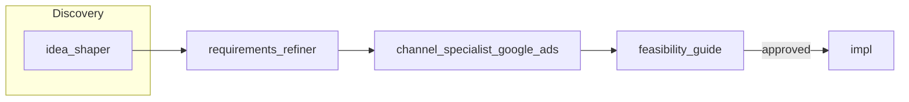

# Agent Workflow

This document defines the pipeline order, handoffs, and branching rules for the agent set. Use it to orchestrate agents (manually or via a parent agent).

## Pipeline overview

## Work tracking

**All work items (issues) must be created and updated in this project only:**

- **Project:** [DrivvenConsulting/projects/6](https://github.com/orgs/DrivvenConsulting/projects/6)
- **Designated repo for work items:** [DrivvenConsulting/adlyze](https://github.com/DrivvenConsulting/adlyze). Create all feature-tracking issues in this repo; do not create them in the current (product-context) repository.
- When creating issues via GitHub MCP: create the issue in **DrivvenConsulting/adlyze** and **add it to project 6** so it appears on the board.

Project columns:

| Column | When |
|--------|------|
| **Backlog** | After requirements_refiner (and channel_specialist when applicable); before feasibility approval. |
| **Ready** | After feasibility_guide approves. |
| **In Progress** | When implementation work is in progress (e.g. in **DrivvenConsulting/adlyze**). |
| **In Review** | When PR(s) are under review. |
| **Done** | Merged and accepted. |

If the MCP does not support project board APIs, agents document the intended column (e.g. in the work item body or in the artifact) so a human or parent agent can move the item.

## Artifact format

Agents in this repo (**idea_shaper**, **requirements_refiner**, **channel_specialist_google_ads**, **feasibility_guide**) return **JSON** as their primary output. Implementation (e.g. PRs) is performed in other repositories.

### Artifact paths

All agents write artifacts under **`artifacts/feature-definitions/<feature_name>/`** where `<feature_name>` is a snake_case slug (e.g. `google_sso`, `export_daily_reports`). Canonical filenames:

| File | Producer |
|------|----------|
| `feature-definition.json` | idea_shaper |
| `github_issue.json` | requirements_refiner |
| `technical-feasibility.json` | feasibility_guide |
| `channel-feasibility-google-ads.json` | channel_specialist_google_ads (mandatory for every feature) |

The parent agent or inputs must supply `<feature_name>` so each agent can write to the correct folder.

## Stages

### 1. Problem framing (choose one path)

| Agent | When to use | Inputs | Output | Next step |
|-------|-------------|--------|--------|-----------|
| **idea_shaper** | Only a problem statement and context alignment are needed (quick validation, or before human-led discovery). | Raw idea; optional Confluence vision. | **JSON artifact** (`feature-definition.json`: feature_id, title, problem_statement, context_alignment, assumptions, feature_distinctiveness, user_journeys when present). | Pass **entire** JSON artifact to **requirements_refiner**. |

- Use **idea_shaper** for problem-only framing.

### 2. Requirements

| Agent | Inputs | Output | Next step |
|-------|--------|--------|-----------|
| **requirements_refiner** | **Entire** idea_shaper JSON output (full `feature-definition.json`: feature_id, title, problem_statement, context_alignment, assumptions, feature_distinctiveness, user_journeys when present); target project DrivvenConsulting/projects/6; repo **DrivvenConsulting/adlyze**. | **JSON artifact** (issue definition: title, description, user_stories, acceptance_criteria, assumptions, references). Writes to `artifacts/feature-definitions/<feature_name>/github_issue.json`. Creates work item in **DrivvenConsulting/adlyze** and adds to project 6; sets column to **Backlog**. | Run **channel_specialist_google_ads** (mandatory), then **feasibility_guide**. |

- **requirements_refiner** receives the **entire** JSON output from idea_shaper (the full `feature-definition.json`), not only the problem statement. It uses all provided fields (e.g. user_journeys, context_alignment) to derive user stories and acceptance criteria.
- After creating the work item, the next step in the workflow is channel validation, then technical feasibility.

### 3. Channel validation (mandatory)

| Agent | Inputs | Output | Next step |
|-------|--------|--------|-----------|
| **channel_specialist_google_ads** | Work item in **Backlog** (DrivvenConsulting/projects/6); work item URL/number; repo **DrivvenConsulting/adlyze**. | **JSON artifact** (channel feasibility: scope/available_data, constraints, risks, recommendation). Writes to `artifacts/feature-definitions/<feature_name>/channel-feasibility-google-ads.json`. May append Channel Feasibility section to the work item. | Run **feasibility_guide**. |

- This agent runs **after** the work item is created (Backlog) and **before** technical feasibility (feasibility_guide). **Channel validation is mandatory for every feature.**
- **The channel-feasibility artifact must be produced for every feature.** When the feature does not touch Google Ads (or the channel), the agent still runs and produces the artifact with an explicit statement that the feature does not touch the channel (e.g. `feature_scope: "does_not_touch_google_ads"`, `recommendation: "proceed"`, and a short explanation in `recommendation_guidance` or `available_data_explanation`).

### 4. Technical feasibility

| Agent | Inputs | Output | Next step |
|-------|--------|--------|-----------|
| **feasibility_guide** | Work item in **Backlog** (DrivvenConsulting/projects/6) **with** Channel Feasibility artifact/section (required for every feature); architecture context. | **JSON artifact** (technical feasibility: technical_feasibility, data_considerations, dependencies, blocker_reason). Writes to `artifacts/feature-definitions/<feature_name>/technical-feasibility.json`. Adds Technical Feasibility section to work item; if approved moves to **Ready**, else stays **Backlog**. | If **Ready**: hand off for implementation (e.g. in **DrivvenConsulting/adlyze**). If **Backlog**: address blockers before re-running feasibility. |

- The **channel-feasibility artifact** (e.g. `channel-feasibility-google-ads.json`) must exist for every feature before running feasibility_guide. When the feature does not touch the channel, the artifact explicitly states so (e.g. `feature_scope: "does_not_touch_google_ads"`). If the artifact is missing, run channel_specialist_google_ads first.

## Branching rules

1. **Channel Feasibility says "adjust requirements"**  
   Loop back to **requirements_refiner**: either update the existing work item (with a comment or body edit describing the adjustment) or create a follow-up item. Do not move to feasibility_guide until requirements are updated and channel specialist is re-run.

2. **Technical Feasibility is "blocked"**  
   Leave the work item in **Backlog**. Do not move to Ready. Document in the work item what is blocking and what would unblock. Optionally create a follow-up item for the blocker.

3. **Work item touches multiple channels**  
   Run each relevant channel specialist (e.g. channel_specialist_google_ads) and ensure all Channel Feasibility sections are on the work item before running feasibility_guide.

4. **Project [DrivvenConsulting/projects/6](https://github.com/orgs/DrivvenConsulting/projects/6)**  
   All work-item creation and state updates target this project only. If the project has no "Ready" column, use the closest equivalent (e.g. "Ready for dev") and note it to the parent agent or in the work item.